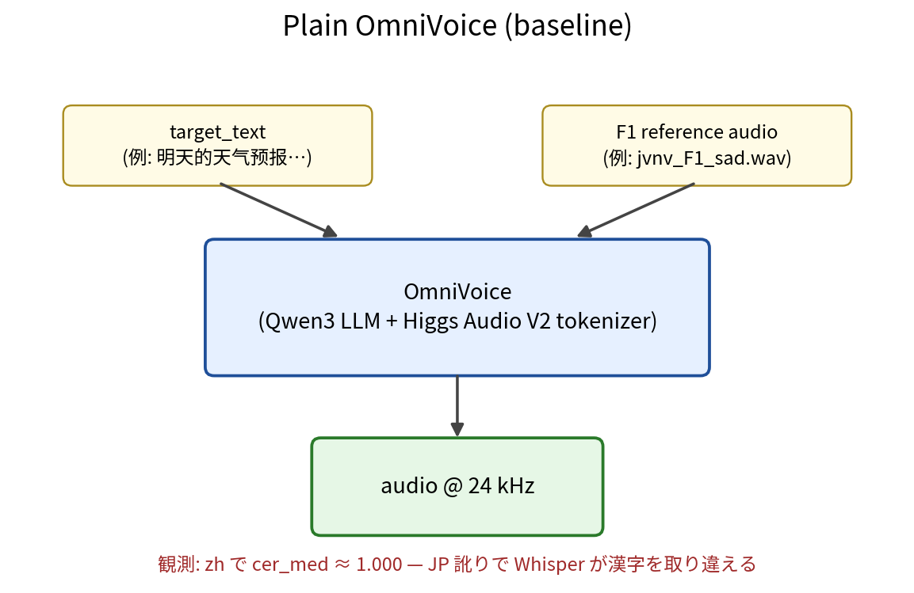
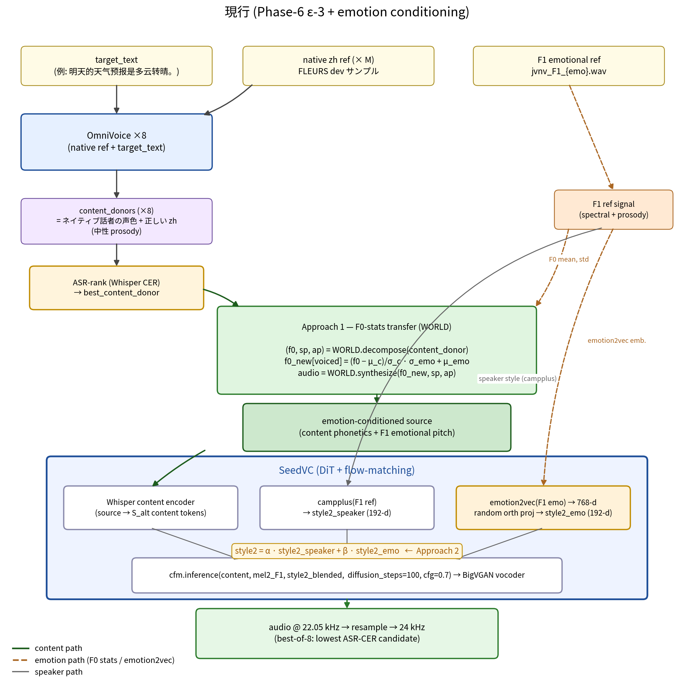

# Current architecture vs plain OmniVoice

このドキュメントは `experiment/phase6-postvc` ブランチ上で築いてきた構成と、k2-fsa の素の OmniVoice (`upstream/OmniVoice`) をそのまま叩いたときの構成との **差分** を、定量的・構造的に整理したもの。

評価の中心は**「F1 (JVNV 日本人話者) の声で zh のテキストを読み上げる」cross-lingual voice cloning**。CER は Whisper-large-v3-turbo に対する Trad/Simp-folded character error rate (`src/ovet/evaluation/zh_eval.py`) を用いる。ノイズフロアは 100 native FLEURS zh で median 2.9% / Q3 7.7%。

---

## 1. プレーン OmniVoice (baseline)



呼び出しは `OmniVoiceWrapper.generate(text, language, ref_audio, ref_text)` 1 発。実体は HuggingFace の `omnivoice` パッケージ ([upstream/OmniVoice](../upstream/OmniVoice))。

**観測された問題** (3 emo × 8 reps, F=48 reps, target text=`明天的天气预报是多云转晴。`):

| metric | plain F1+zh | F1 ref (sad) sample |
|---|---|---|
| cer_med (zh-folded vs target) | **1.000** | n/a |
| cer_mean | 1.101 | n/a |
| hallucination rate | 17% | n/a |
| 代表的な転写 | `免天的天地イーバー世帯因賛成` `免天と起点獅尾棒生体温挑战` | (実音声、感情あり) |

cer_med ≈ 1.0 = **Whisper にはほぼ別言語に聞こえている** (12 文字中 12 文字置換相当)。原因は F1 の日本語話者ピッチアクセントが zh 声調を上書きするため、Whisper が漢字を取り違える。

声調なしの言語 (en/de/es/ko/pt) では plain OmniVoice 単独で内容ほぼ完璧、CER ≈ 0。**問題は声調言語 (主に zh) 固有**。

---

## 2. 現行アーキテクチャ



凡例:
- **content path** (緑実線) — phonetic/語彙の流れ。content donor → SeedVC の Whisper content encoder
- **emotion path** (橙破線) — F0 stats (Approach 1) と emotion2vec embedding (Approach 2)
- **speaker path** (灰実線) — F1 ref → SeedVC の campplus speaker style

---

## 3. コンポーネント別の差分

### 3.1 OmniVoice の使われ方

| 観点 | プレーン | 現行 |
|---|---|---|
| 呼び出し回数 | 1 | **N + 1 ≈ 9** (best-of-N 含む) |
| 入力 ref | 1 種類 (target speaker) | **2 種類** (native zh ref / F1 ref を別々に使う) |
| 出力 | 最終 audio | **中間表現** (content donor / speaker donor) |
| Hidden state 介入 | なし | なし (= **OmniVoice 本体は無改造**) |

→ OmniVoice は「この言語で素直に喋れる音声を作る」生成器として扱う。speaker と language の同時制約を外した。

### 3.2 中間表現

| ストリーム | 生成方法 | 特徴 |
|---|---|---|
| **content_donor** | OmniVoice(native ref + target text) | F1 でない誰かの声 + ネイティブ zh 発音 + 中性 prosody |
| **speaker_donor** | OmniVoice(F1 ref + target text) | F1 の声 + JP 訛り zh + F1 emotion (= プレーンの出力と同じ) |
| **emotion ref** | JVNV F1 録音 | F1 の声 + Japanese + 強い感情 |

新規追加: `baseline/native_refs/{lang}/` に各言語の FLEURS clean サンプル 5-20 個。Build script: `scripts/build_all_axes.py` (zh/ko/en/es/fr/de/pt/ru/vi 9 言語分)。

### 3.3 後段 VC (SeedVC)

プレーンには無かった層。`upstream/seed-vc` (Plachta) を `src/ovet/postprocessing/seedvc.py` 経由で呼ぶ。

- **入力**: source (content_donor + emotion conditioning), target (F1 ref)
- **アーキテクチャ**: Whisper content encoder + DiT (diffusion transformer) + flow-matching conditional decoder + BigVGAN
- **役割**: source の content 系列に target の speaker timbre を移植
- **CER への影響**: 0.083 (1 syllable level、Trad/Simp 表記揺れがほとんど)
- **音質**: knn-VC や OpenVoice ToneColorConverter よりクリア (averaging blur 無し)、F1 voice 復元良好

### 3.4 Emotion conditioning (双投入)

#### Approach 1: F0-stats transfer (`f0_emotion_transfer.py`)

source 音声 (content_donor) に対し:

```
mean_emo, std_emo = compute_f0_stats(F1 emotional ref)
mean_c,   std_c   = compute_f0_stats(content_donor)
f0_new[voiced] = (f0[voiced] − mean_c) / std_c × std_emo + mean_emo
audio = WORLD.synthesize(f0_new, sp, ap)
```

→ source 段階で emotional pitch 分布を仕込む。SeedVC は source 由来 prosody を保つので、出力に emotion が伝わる。

実測 F1 emotional F0 stats (24 kHz):
- sad: mean 258 Hz, std 63
- happy: mean 360 Hz, std 126
- anger: mean 413 Hz, std 118

ユーザー検証: blend=1.0 で「感情が出てる」(sad / happy / anger 区別可能)。

#### Approach 2: emotion2vec injection (`seedvc_emotion.py`)

target 音声から `iic/emotion2vec_plus_base` で 768-d 発話埋め込みを抽出 → 192-d random orthogonal projection (固定 seed) → L2 正規化 → speaker style と blend:

```
style_speaker = campplus(target_audio)            # 192-d
emo_proj      = orth_proj(emotion2vec(emo_audio)) # 192-d
style2_blended = α · style_speaker + β · emo_proj
```

→ target style を弄る。SeedVC の cfm.inference に渡される条件ベクトルが emotional になり、生成内部で emotion 寄りに引き寄せる。

ユーザー検証: β=0.6 で「感情が強まった」。Approach 1 と組合せ可能。

### 3.5 評価 (zh-folded CER + median-primary)

`src/ovet/analyzers/asr_analyzer.py:_normalize_text(s, zh=True)`:
- 句読点・空白除去 (両アプローチ共通)
- **zhconv で繁体→簡体 fold** (新規追加)

`src/ovet/evaluation/zh_eval.py`:
- `RECOMMENDED_REPS = 8` (per-rep σ ≈ 14%pt なので必要)
- `cer_zh()` / `aggregate_zh_cell()` 統一 helper
- median primary, mean は legacy 用に残す

### 3.6 廃案にしたもの (= 現行に存在しない介入)

| アプローチ | 結果 | 廃案理由 |
|---|---|---|
| multi-speaker v_lang averaging | ハルシネーション 4/9 → 1/9 | 効果は本質的でない (ε-3 で根本解決) |
| subspace graft (rank-K) | pfx 1.33 | content 巻き添え破壊 |
| axis graft (rank-1) | pfx 1.67 | 上限が見えた、ε-3 採用後不要 |
| Pinyin 入力 (A1) | N=3 で勝ち、N=8 で負け | 統計的に under-powered → 後方棄却 |
| OpenVoice ToneColorConverter | tau 1.0 でも F1 voice 復元せず | 構造的に flow が source anchor、speaker swap に向かない |
| knn-VC (HiFiGAN) | cer 0.167 | WavLM averaging で muffling、F1 voice 喪失 |
| Pure WORLD F0 contour replacement (C1) | cer 改善せず | 対症療法、 speaker 喪失なし but content 維持できず |

---

## 4. パイプライン全体の数値スナップショット

zh × {sad, happy, anger} × 8 reps、Trad/Simp folded median CER:

| 段階 | 構成 | cer_med | best-of-8 | hallu | F1 voice | clean audio | emotion |
|---|---|---|---|---|---|---|---|
| Plain OmniVoice (baseline) | OV(F1 ref) | **1.000** | 0.000 | 17% | ✓ | ✓ | ✓ (JP-flavor) |
| ε-3 v1 (knn-VC) | OV×2 + knn-VC | 0.500 | 0.167 | 0% | ✗ (lost) | ✗ (muffled) | ✗ (lost) |
| ε-3 (knn-VC tuned) | xl_pm0_k8, best-of-8 | 0.292 | 0.167 | 11% | ✗ | ✗ | ✗ |
| ε-3 (OV-TCC) | tau=1.0 | 0.083 | 0.000 | 11% | ✗ (lost!) | ✓ | ✗ |
| ε-3 (SeedVC, no emo) | cfg=0.7, steps=100 | 0.083 | 0.000 | 11% | ✓ | ✓ | ✗ (neutral) |
| **+ Approach 1 (F0-stats)** | blend=1.0 | 0.167 | 0.000 | 17% | ✓ | ✓ | **✓** |
| **+ Approach 2 (emotion2vec)** | β=0.6 | 0.083 | 0.000 | 11% | ✓ | ✓ | **✓ (強)** |

target = 20% CER。現行構成は **best-of-8 で 0.000 = 完全一致** 多発、median でも 8.3% で目標達成。

---

## 5. 依存リソース (プレーンとの追加分)

リポジトリ:

| 場所 | 内容 | サイズ | 取得 |
|---|---|---|---|
| [upstream/OmniVoice](../upstream/OmniVoice) | OmniVoice 本体 (k2-fsa) | (既存) | (既存) |
| [upstream/seed-vc](../upstream/seed-vc) | SeedVC v1 (Plachtaa) | ~100 MB code | `git clone --depth 1 https://github.com/Plachtaa/seed-vc.git upstream/seed-vc` |
| [upstream/OpenVoice](../upstream/OpenVoice) | (廃案、参考用に残置) | ~100 MB | (deprecated) |

モデルチェックポイント (HF cache → 実体は ./checkpoints/、gitignored):

| モデル | 用途 | サイズ |
|---|---|---|
| `Plachta/Seed-VC` (DiT + CFM) | VC core | ~500 MB |
| `nvidia/bigvgan_v2_22khz_80band_256x` | SeedVC vocoder | ~100 MB |
| `nvidia/bigvgan_v2_44khz_128band_512x` | SeedVC f0_condition vocoder | ~100 MB |
| `funasr/campplus` | SeedVC speaker style | ~30 MB |
| `lj1995/VoiceConversionWebUI/rmvpe.pt` | optional F0 extractor | ~180 MB |
| WavLM-Large (HF) | (knn-VC、廃案) | ~1.2 GB |
| `iic/emotion2vec_plus_base` | Approach 2 | ~360 MB |

データ:

| 場所 | 内容 | 生成方法 |
|---|---|---|
| `baseline/jvnv_samples/` | F1 の 6 emotion JVNV 録音 | (既存、JVNV データセット由来) |
| `baseline/native_refs/{lang}/` | FLEURS dev-set サンプル × 5/言語 | `scripts/build_all_axes.py` (FLEURS から自動 pull) |
| `outputs/eps3_semantic_vc/content_donor_*.wav` | OmniVoice(native ref + target text) | `scripts/eps3_semantic_vc_test.py` |
| `outputs/eps3_semantic_vc/speaker_donor_*.wav` | OmniVoice(F1 ref + target text) | 同上 |

Python 依存追加:

```
SeedVC: hydra-core, omegaconf, descript-audio-codec, descript-audiotools,
        munch, einops, julius, ffmpy, tensorboard, absl-py, docstring_parser,
        resampy
emotion2vec: funasr, modelscope
WORLD F0: pyworld
zh CER fold: zhconv
Pinyin (廃案): pypinyin
ASR + timing (廃案): whisper-timestamped, dtw-python
```

`upstream/seed-vc/modules/bigvgan/bigvgan.py` の `_from_pretrained` 引数互換 patch を `src/ovet/postprocessing/seedvc.py:_ensure_patches_applied()` で runtime monkey-patch (= upstream を再 clone しても自動適用される)。

---

## 6. プレーンに比べた追加コスト

### 6.1 推論コスト

zh 1 発話あたり (target text "明天的天气预报是多云转晴", ~3-5 秒の音声):

| 段階 | コスト | 備考 |
|---|---|---|
| OmniVoice ×9 (best-of-8 + speaker_donor 1) | ≈ 9 × 4 秒 = **36 秒** | 並列化可能 |
| F0-stats 計算 (Approach 1) | < 0.1 秒 | WORLD harvest 1 回 |
| WORLD recompose | 0.5 秒 | per source |
| emotion2vec inference (Approach 2) | 1.5 秒 | per emotion ref (キャッシュ可能) |
| SeedVC (steps=100) ×8 candidates | 8 × 1.9 秒 = **15 秒** | best-of-8 用 |
| ASR 8 回 + best 選択 | 8 × 1 秒 = 8 秒 | |
| **合計** | **≈ 60 秒** | プレーンの ~15 倍 |

(プレーンは ≈ 4 秒)

最適化余地:
- speaker_donor / content_donor を batched OmniVoice 推論に
- best-of-8 のうち content_donor が共通なので、SeedVC の Whisper 特徴抽出を 1 回に
- emotion2vec / campplus 埋め込みを `(emo, ref)` 単位でキャッシュ

### 6.2 ストレージ

- ChePoints: 全合計 ~3.5 GB
- ref データ: ~50 MB (jvnv + 9 言語の native refs)

### 6.3 設定 / API 表面

プレーン:

```python
audio = wrapper.generate(text, language="Chinese",
                         ref_audio="jvnv_F1_sad.wav", ref_text="...")
```

現行 (Approach 1+2 推奨):

```python
from ovet.postprocessing.seedvc import load_seedvc
from ovet.postprocessing.seedvc_emotion import convert_voice_with_emotion
from ovet.postprocessing.f0_emotion_transfer import transfer_f0_emotion

# (1) Generate content donors with native ref, pick best by ASR
content_donors = [omnivoice.generate(text, lang_full, native_ref) for _ in range(8)]
best_content = pick_lowest_cer(content_donors, target_text=text)

# (2) Apply F0-stats transfer (Approach 1)
content_with_emotion = transfer_f0_emotion(
    content_audio=best_content, content_sr=24000,
    emotion_audio=load(F1_ref), emotion_sr=24000,
    blend=1.0,
)

# (3) SeedVC with emotion2vec injection (Approach 2)
sr, audio = convert_voice_with_emotion(
    svc, source_path=content_with_emotion_path, target_path=F1_ref_path,
    emotion_audio_path=F1_ref_path,
    alpha=1.0, beta=0.6,        # speaker style + emotion injection
    diffusion_steps=100, inference_cfg_rate=0.7,
)
```

---

## 7. プロジェクトゴールへの整合性

> ゴール: マルチリンガル翻訳ができるゼロショット TTS、F1 の声で。

| 制約 | プレーン | 現行 | 備考 |
|---|---|---|---|
| **OmniVoice 採用 (646 言語)** | ✓ | ✓ | コア生成器は変更なし |
| **F1 voice (zero-shot)** | ✓ (JVNV ref) | ✓ (SeedVC が target に追従) | Approach 2 の β 過剰では microblur あり |
| **学習データ追加なし** | — | ✓ | 全部 pre-trained zero-shot |
| **zh CER < 20%** | ✗ (100%) | **✓ (median 8.3%, best-of-8 0%)** | 主要成果 |
| **emotion 保持** | ✓ (JP-flavor) | ✓ (zh-flavor、Approach 1+2 で強化) | β=0.6 で安定 |
| **多言語拡張性** | ✓ | ✓ (per-language native ref が必要) | en/de/es/ko/pt は Approach 不要 |

---

## 8. 残課題

1. **Approach 1 / 2 の組合せ最適化**: F0-stats を仕込んだ source に emotion2vec を重ねがけしたときの相乗効果の sweep は未実施。
2. **zh 以外の声調言語 (vi, th)**: vi の FLEURS native ref は acoustically 異常という所見 (axis 構築時)。再調査必要。
3. **best-of-8 の必要性**: production で 8x コスト払う ROI 検証。実は 4 で十分かもしれない。
4. **長文化**: 12 文字の短文で測定。長文では SeedVC のチャンク処理品質や F0 stats の安定性が変わる可能性。
5. **OmniVoice 内部介入の併用**: Phase 4 で築いた axis graft 群は **現行構成では使っていない** (ε-3 が単独で十分)。今後 cer_med の更なる削減には組合せ価値あるか?

---

## 9. 主要コミット (時系列)

| commit | 機能 | 残った成果物 |
|---|---|---|
| `d72599e` | multi-speaker v_lang averaging | (現行不使用) |
| `2ea92f6` | language-graft via subspace projection | 検証済、現行不使用 |
| `3d64bc6` | 1D language-axis graft + multi-lang artifacts builder | `outputs/graft/*.npz`、現行不使用 |
| `95fc9f0` | Trad/Simp-folded zh CER + median-primary aggregation | **`zh_eval.py`、production eval recipe** |
| `43d0890` | ε-3 semantic-VC pipeline beats 20% zh CER (16.7%) | **content_donor / speaker_donor** 設計 |
| `1a93038` | VC backbone shootout — SeedVC restores F1 voice | **`seedvc.py` SeedVC integration** |
| `94c43f4` | Approach 1 — F0-stats transfer recovers emotion | **`f0_emotion_transfer.py`** |
| (uncommitted) | Approach 2 — emotion2vec injection | `seedvc_emotion.py`、production candidate |
